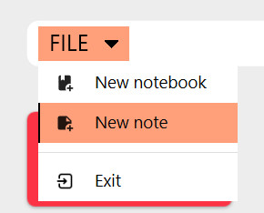
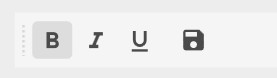
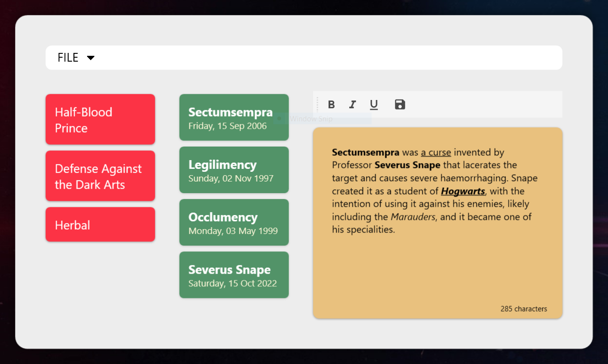

# NoteApp

**Highlight**:  
- Using [Material Design][0] 🌈
- Local Database [SQL Server][1]
- MVVM architecture

**Note**:
- This is my second WPF App 
- It will be added with other features later (such as Login, Cloud Database, better UI Design, ...)

Do you know who I am referring to in this app?   
[Severus Snape][2]🦉🐦

**Features**
- Add new notebook, new note
- Exit app

    

- Implement a Formatting Toolbar
  

    

## Screenshots

    

[0]: https://material.io/develop
[1]: https://www.microsoft.com/en-us/sql-server/sql-server-downloads
[2]: https://harrypotter.fandom.com/wiki/Severus_Snape